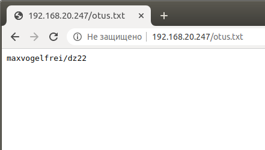

# Простая защита от DDOS

Образ maxvogelfrei/dz22:latest
```bash
docker run -d -p 80:80 maxvogelfrei/dz22:latest
```
```bash
[root@centos7 linux-dz-22]# curl http://localhost/otus.txt
<html>
<head><title>302 Found</title></head>
<body>
<center><h1>302 Found</h1></center>
<hr><center>nginx/1.17.10</center>
</body>
</html>
```

